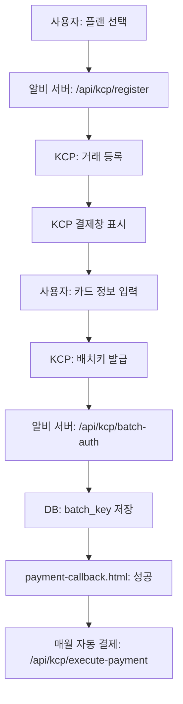

# 🚀 KCP 정기결제 연동 배포 완료

작성일: 2026-03-19
상태: ✅ 배포 완료, 환경 변수 설정 필요

---

## ✅ **완료된 작업**

### 1. **KCP API 서버 구현** ✅
**파일**: `/functions/api/kcp/[[path]].ts`

**API 엔드포인트**:
- `POST /api/kcp/register` - 거래 등록 (배치키 발급 요청)
- `POST /api/kcp/batch-auth` - 배치키 발급 응답 처리  
- `POST /api/kcp/execute-payment` - 정기결제 실행
- `GET /api/kcp/batch-key/:user_id` - 배치키 상태 조회

### 2. **DB 마이그레이션 완료** ✅
**로컬**: ✅ 16 commands 성공  
**프로덕션**: ✅ 이미 적용됨

**생성된 테이블**:
- `kcp_transactions` - 거래 등록 및 배치키 발급 내역
- `kcp_payments` - 정기결제 실행 내역
- `users` 테이블 확장 - `kcp_batch_key`, `subscription_status`, `subscription_plan` 등

### 3. **결제 완료 페이지** ✅
**파일**: `/public/payment-callback.html`

**기능**:
- 성공 시: 구독 시작 안내, 멘토 채팅/구독 관리 링크
- 실패 시: 오류 메시지, 재시도/고객 지원 링크

### 4. **환경 변수 설정** ✅
**로컬** (`.dev.vars`):
```
KCP_SITE_CD=A52Q7
KCP_SITE_KEY=your_site_key_here
KCP_SITE_NAME=알비
KCP_CHANNEL_KEY=channel-key-e6e1d9a4-8f9a-435c-a0fc-4ea301e79c66
```

### 5. **GitHub 푸시 완료** ✅
**커밋**: `968c7d9` - "fix: Update KCP API to use Cloudflare Pages handle function"  
**브랜치**: `main`  
**상태**: Cloudflare Pages 자동 배포 진행 중 (3-5분 예상)

---

## ⚠️ **즉시 필요한 작업**

### 🔴 **1. Cloudflare Pages 환경 변수 설정** (필수)

**설정 위치**:
```
https://dash.cloudflare.com
→ Pages
→ albi-app
→ Settings
→ Environment variables
→ Production 탭
```

**추가할 변수**:
```
변수 이름: KCP_SITE_CD
값: A52Q7

변수 이름: KCP_SITE_KEY
값: (KCP에서 발급받은 사이트 키)

변수 이름: KCP_SITE_NAME
값: 알비

변수 이름: KCP_CHANNEL_KEY
값: channel-key-e6e1d9a4-8f9a-435c-a0fc-4ea301e79c66
```

**⚠️ 중요**: Preview 환경에도 동일하게 추가하세요!

**설정 후**: "Retry deployment" 클릭 (재배포 필요)

---

### 🟡 **2. payment.html JavaScript 수정** (선택)

현재 payment.html은 여전히 PortOne SDK를 사용합니다.  
KCP 정기결제로 완전히 전환하려면 JavaScript 수정이 필요합니다.

**상세 가이드**: `/home/user/webapp/KCP_INTEGRATION_GUIDE.md`

**핵심 수정 사항**:
1. PortOne SDK 제거
2. `requestPayment()` → `requestKCPSubscription()` 교체
3. KCP 결제창 호출 로직 추가

**또는**: 
현재 상태로 두고 PortOne과 KCP를 병행 사용할 수도 있습니다.

---

## 🧪 **테스트 방법**

### **Step 1: Cloudflare 배포 확인**
```
https://dash.cloudflare.com
→ Pages → albi-app → Deployments
→ 최신 배포 (커밋 968c7d9) 확인
→ 상태: Success
```

### **Step 2: 환경 변수 설정**
위의 "1. Cloudflare Pages 환경 변수 설정" 참고

### **Step 3: 재배포**
환경 변수 설정 후:
```
Deployments 탭
→ 최신 배포 옆 "⋯" 클릭
→ "Retry deployment" 클릭
→ 2-3분 대기
```

### **Step 4: KCP API 테스트**
```bash
# 거래 등록 API 테스트
curl -X POST https://albi.kr/api/kcp/register \
  -H "Content-Type: application/json" \
  -d '{
    "plan_type": "standard",
    "user_id": "test_user_123",
    "user_name": "홍길동",
    "user_email": "test@example.com",
    "amount": 4900
  }'

# 예상 응답:
# {
#   "success": true,
#   "data": {
#     "ordr_idxx": "ALBI_...",
#     "approval_key": "...",
#     "pay_url": "https://testsmpay.kcp.co.kr/pay/mobileGW.kcp",
#     ...
#   }
# }
```

### **Step 5: 결제 완료 페이지 테스트**
```
https://albi.kr/payment-callback.html?success=true&plan=standard&amount=4900
https://albi.kr/payment-callback.html?success=false&message=테스트+실패
```

---

## 📊 **KCP 테스트 채널 정보**

| 항목 | 값 |
|------|-----|
| **채널 이름** | KCP 테스트2 |
| **PG Provider** | kcp_v2 |
| **채널 키** | channel-key-e6e1d9a4-8f9a-435c-a0fc-4ea301e79c66 |
| **PG상점아이디** | A52Q7 |
| **정기/자동결제** | 그룹아이디: A52Q71000489 |
| **수동 승인 사용** | 사용 안함 |

---

## 🔍 **KCP 정기결제 테스트 카드**

**KCP 개발 환경 테스트용**:
```
카드번호: 9446-0100-1234-5678
유효기간: 12/25
CVC: 123
비밀번호: 00
생년월일: 900101
```

---

## 📁 **생성/수정된 파일**

| 파일 | 설명 | 라인 수 |
|------|------|--------|
| `/functions/api/kcp/[[path]].ts` | KCP API | 338 |
| `/migrations/0030_create_kcp_tables.sql` | DB 마이그레이션 | 45 |
| `/public/payment-callback.html` | 결제 완료 페이지 | 86 |
| `/.dev.vars` | 로컬 환경 변수 | 7 |
| `/KCP_INTEGRATION_GUIDE.md` | 통합 가이드 | 470 |
| `/public/payment.html.backup-portone` | 기존 파일 백업 | 793 |

---

## 🎯 **KCP 정기결제 작동 흐름**



**1. 최초 구독 (배치키 발급)**
- 사용자가 플랜 선택 + 결제 정보 입력
- 알비 → KCP 거래 등록 요청
- KCP 결제창 표시 (카드 정보 + 본인 인증)
- KCP → 배치키 발급
- 알비 → DB에 batch_key 저장

**2. 정기결제 (매월 자동 청구)**
- 스케줄러: 매월 1일 0시 실행
- 알비 → KCP 배치결제 API 호출 (batch_key 사용)
- KCP → 인증 없이 자동 결제
- 알비 → 결제 내역 DB 저장 + 포인트 추가

---

## 📋 **다음 단계 체크리스트**

### **즉시 실행** (수동 작업)
- [ ] Cloudflare Pages 환경 변수 설정 (KCP_SITE_CD, KCP_SITE_KEY 등)
- [ ] 환경 변수 설정 후 "Retry deployment" 클릭
- [ ] 배포 완료 대기 (2-3분)
- [ ] `/api/kcp/register` API 테스트
- [ ] `/payment-callback.html` 페이지 테스트

### **선택 작업** (나중에)
- [ ] payment.html JavaScript를 KCP 전용으로 수정
- [ ] KCP 운영 계약 (실제 site_cd, site_key 발급)
- [ ] 정기결제 스케줄러 구현 (Cloudflare Cron Triggers)
- [ ] 프로덕션 환경 최종 테스트

---

## 🚨 **문제 해결**

### **Q1: API 404 오류**
**원인**: 환경 변수 미설정 또는 배포 미완료  
**해결**: Cloudflare 환경 변수 설정 후 재배포

### **Q2: batch_key 발급 실패**
**원인**: KCP 테스트 카드 정보 오류  
**해결**: 위의 "KCP 정기결제 테스트 카드" 정보 정확히 입력

### **Q3: DB 테이블 없음**
**원인**: 마이그레이션 미실행  
**해결**: `npx wrangler d1 migrations apply albi-production`

---

## 📞 **지원**

### **KCP 기술 지원**
- 개발자 문서: https://developer.kcp.co.kr
- 전화: 1544-8661
- 이메일: tech@kcp.co.kr

### **Cloudflare 지원**
- 문서: https://developers.cloudflare.com/pages
- Dashboard: https://dash.cloudflare.com

---

## ✅ **완료 상태**

| 항목 | 상태 | 비고 |
|------|------|------|
| KCP API 코드 | ✅ | 완료 |
| DB 마이그레이션 | ✅ | 로컬/프로덕션 모두 완료 |
| 결제 완료 페이지 | ✅ | 완료 |
| 로컬 환경 변수 | ✅ | .dev.vars 생성 |
| GitHub 푸시 | ✅ | 커밋 968c7d9 |
| 프로덕션 환경 변수 | ⚠️ | **수동 설정 필요** |
| payment.html 수정 | ⚠️ | **선택 사항** |
| 최종 테스트 | ⏳ | 환경 변수 설정 후 |

---

**배포 URL**: https://albi.kr  
**상태**: 🔄 Cloudflare Pages 자동 배포 진행 중  
**다음 작업**: Cloudflare Dashboard에서 환경 변수 설정

🚀 **환경 변수 설정 후 바로 사용 가능합니다!**
